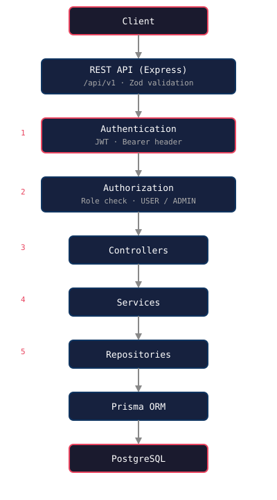

# TypeScript SaaS API Starter

[](https://github.com/3278mediadotcom/typescript-saas-api-starter/actions/workflows/test.yml)

Production-style TypeScript SaaS backend starter demonstrating authentication, authorization, database architecture, and scalable API patterns.

## Overview

A reference SaaS backend architecture built with TypeScript, Express, and Prisma. Models a multi-tenant data layer (User → Organization → Project → ApiKey → AuditLog), a full JWT authentication flow, and role-based authorization.

## Features

- **Multi-tenant data model** — Organization-scoped resources (Stripe/GitHub style)
- **JWT authentication** — register, login, protected routes
- **Role-based authorization** — `USER` / `ADMIN` via middleware
- **Repository + service pattern** — clean separation of concerns
- **Zod request validation** — malformed payloads rejected early
- **Audit logging** — register, login, org/project/key actions
- **Hashed API keys** — `sk_live_...` stored as SHA-256, never plain text
- **Interactive API docs** — Swagger UI at `/api/v1/docs`
- **Structured JSON logging** — parseable by Datadog/CloudWatch
- **Consistent error handling** — `AppError` with machine-readable codes
- **Automated testing** — Vitest + Supertest (15 tests)
- **Docker support** — `docker compose up` runs Postgres + API

## Architecture



1. Request hits the versioned REST API (`/api/v1`) with Zod validation
2. `authenticate` verifies the JWT and loads the user
3. `authorize("ADMIN")` enforces roles
4. Controller → Service (business rules) → Repository (Prisma) → PostgreSQL

## Tech Stack

- **TypeScript** — type safety end-to-end
- **Express** — HTTP framework
- **Prisma** — database ORM
- **PostgreSQL** — relational database
- **Zod** — runtime validation
- **JWT** — authentication
- **bcrypt** — password hashing
- **Helmet / CORS** — security middleware
- **Vitest + Supertest** — testing

## Project Structure

```
src/
├── app.ts                # Express app factory
├── server.ts             # Entry point + graceful shutdown
├── config/               # Environment configuration
├── controllers/          # HTTP request/response handling
├── database/             # Prisma client singleton
├── middleware/           # Auth, authorization, error handling
├── repositories/         # Database queries
├── routes/               # Versioned API routes
├── schemas/              # Zod validation schemas
├── services/             # Business logic
├── types/                # Shared types
└── utils/                # AppError, logger, etc.
```

## API Documentation

### `GET /api/v1/health`

Health check for load balancers and monitoring.

### `POST /api/v1/auth/register`

Request:

```json
{
  "email": "user@example.com",
  "password": "password123"
}
```

Response (201):

```json
{
  "token": "<jwt>",
  "user": { "id": "…", "email": "user@example.com", "role": "USER" }
}
```

### `POST /api/v1/auth/login`

Request:

```json
{
  "email": "user@example.com",
  "password": "password123"
}
```

Response (200):

```json
{
  "token": "<jwt>",
  "user": { "id": "…", "email": "user@example.com", "role": "USER" }
}
```

### `GET /api/v1/users/me` (authenticated)

Returns the current user profile.

### `POST /api/v1/organizations` (authenticated)

Creates an organization owned by the current user. Body: `{ "name": "Acme Corp" }`.

### `GET /api/v1/audit-logs` (admin only)

Lists audit logs. Optional filters: `?userId=<id>`, `?projectId=<id>`.

### `DELETE /api/v1/users/:id` (admin only)

Deletes a user.

## Database Design

Multi-tenant SaaS data model:

```
User
 │
 ├── owns Organization(s)
 │        └── contains Project(s)
 │                 ├── has ApiKey(s)
 │                 └── has AuditLog(s)
 └── has AuditLog(s)
```

| Model | Purpose |
|---|---|
| `User` | Auth credential + role (`USER` / `ADMIN`) |
| `Organization` | Multi-tenant boundary; owns resources |
| `Project` | A scoped unit of work inside an organization |
| `ApiKey` | Hashed API key for programmatic access |
| `AuditLog` | Immutable record of security + business actions |

Security: only **hashed** API keys (`sk_live_...` → SHA-256) are stored, same principle as passwords.

## Authentication Flow

```
Client                     API
  │                          │
  │  POST /auth/login        │
  ├─────────────────────────►│
  │  { email, password }     │
  │                          │  verify bcrypt hash
  │                          │  sign JWT
  │  JWT + user              │
  │◄─────────────────────────┤
  │                          │
  │  GET /users/me           │
  ├── Authorization: Bearer ─►│  authenticate middleware
  │  <token>                 │  authorize middleware
  │                          │
  │  200 user                │
  │◄─────────────────────────┤
```

- **Register**: zod validate → email uniqueness check → bcrypt hash → create user → audit log → sign JWT
- **Login**: find user → bcrypt compare → sign JWT → `USER_LOGIN` audit log
- **Protected routes**: `authenticate` verifies the JWT and loads the user; `authorize("ADMIN")` enforces roles
- Generic `INVALID_CREDENTIALS` errors never reveal whether the email or password was wrong
- **Refresh tokens**: documented strategy for this repo — an access token with configurable expiration (`JWT_EXPIRES_IN`) is sufficient; rotation can be added without breaking the flow

## Security Features

<!-- TODO: List security measures as they are built -->

- Helmet security headers
- CORS whitelisting
- Structured error responses (no stack traces leaked)
- `AppError` with machine-readable codes (`UNAUTHORIZED`, `FORBIDDEN`, `INVALID_PAYLOAD`, …)
- bcrypt password hashing (10 salt rounds)
- JWT verification + role-based authorization (`USER` / `ADMIN`)
- API keys stored hashed (SHA-256), never in plain text
- Audit logging for registration, login, and admin actions

## API Documentation (Swagger)

Interactive OpenAPI docs are served at:

```text
http://localhost:3000/api/v1/docs
```

Raw spec:

```text
http://localhost:3000/api/v1/docs/json
```

Covers register, login, me, organizations, and audit-logs with request/response examples.

## Docker

One command starts PostgreSQL + the API:

```bash
docker compose up
```

- API: `http://localhost:3000`
- PostgreSQL: `localhost:5432`

Apply the migration and seed demo data:

```bash
docker compose exec api npx prisma migrate deploy
docker compose exec api npm run db:seed
```

## Running Locally

### Prerequisites

- Node.js 18+
- PostgreSQL

### Installation

```bash
npm install
```

### Environment Setup

```bash
cp .env.example .env
```

Then edit `.env` with your database URL and JWT secret.

### Database Setup

```bash
npm run db:generate   # Generate Prisma client
npm run db:migrate    # Run migrations (needs DATABASE_URL)
npm run db:seed       # Seed demo data (admin@3278media.com)
npm run db:studio     # Visual database inspector
```

### Run in Development

```bash
npm run dev
```

Server starts at `http://localhost:3000`.

### Production Build

```bash
npm run build
npm start
```

## Testing

```bash
npm test